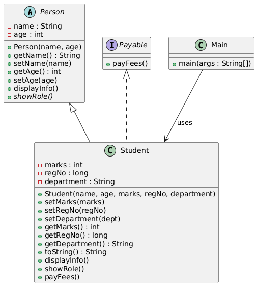

📘 Student Management System – OOP Mini Project (Java)

A console-based Student Management System built using core Object-Oriented Programming (OOP) concepts in Java.

This project demonstrates:

Inheritance

Abstract Classes

Interfaces

Encapsulation

Polymorphism

Validation

Menu-based console system

Multi-student handling using ArrayList

🧱 Project Structure
OOP/
 ├── Person.java         (abstract parent class)
 ├── Student.java        (child class + Payable interface + validations)
 ├── Payable.java        (interface)
 └── Main.java           (menu-based console application)

🖼 UML Diagram

🧠 OOP Concepts Used
🔹 1. Inheritance

Student extends Person.

🔹 2. Abstract Class

Person is abstract and forces child classes to implement showRole().

🔹 3. Interface

Payable ensures all payable entities implement payFees().

🔹 4. Encapsulation

All fields are private and accessed through getters/setters with validation.

🔹 5. Polymorphism

showRole() and payFees() behave differently depending on the object.

▶️ How to Run
Compile all files:
javac OOP/*.java

Run Main:
java OOP.Main

📋 Menu Options
1. Add student
2. List students
3. Update marks
4. Pay fees
5. Show role
6. Exit

🧪 Sample Output
--- Student App ---
1. Add student
2. List students
3. Update marks
4. Pay fees
5. Show role
6. Exit
Choose:

🚀 Why This Project Is Useful

Demonstrates real-world OOP design

Shows strong understanding of object relationships

Contains full validation (production-style)

Great starter project for resumes

Easy to extend into a large system later

💡 Future Enhancements

Search student by RegNo or name

Delete student

Save data to a file or database

Add login system (Admin / Student)

Move menu system to a separate class

Add JSON/XML export

Add fees balance tracking

👤 Author

Jayakrishna (Jay)